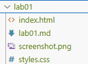

# WAS500 - Web Application Scripting

Welcome to the public repository for the **WAS500 - Web Application Scripting** course labs. This repository is maintained by **Sean Feng** for distributing weekly lab instructions and providing resources for students enrolled in the course.

## Repository Structure

```
./
├── lab01/
│   └── lab01.md
├── lab02/
│   └── lab02.md
├── lab03/
│   └── week03.md
├── ...
├── labXX/
│   └── labXX.md
├── report_template.md
└── README.md
```

- **`./labXX/labXX.md`**: Weekly lab instructions will be available here. Each week, a new lab will be added corresponding to the current week of the course.
- [**`./report_template.md`**](./report_template.md): A markdown template that students must use for submitting their lab reports.

## Lab Submission Guidelines

1. **Create** a **private repository** on GitHub named **`was500-labs`** for your lab submissions.
2. **Invite** me (**`yuhui-feng_seneca`**) as a **collaborator** to your repository. Without access, I cannot grade your reports.
3. **Organize** your repository following the exact naming conventions provided in each lab instruction:
   - Example for Week 1: `./lab01/lab01.md` with all necessary files placed in the `lab01` folder, see image below:
   
   
4. Carefully **review** the **Deliverables** section of the instructions to ensure all required elements are included. 
   - If the instructions specify a **code block**, add a markdown code block in your labxx.md file under the appropriate section. 
   -  If an **image** is required, insert it in your labxx.md file using the correct image syntax.
5. **Commit and push** your completed lab to your private repository **before the deadline**. I have automated the pull actions, so any late push will not be obtained and therefore will not be used for grading.
6. **Email** me at least **24 hours prior to the deadline** if you need to request an extension. A valid reason must be provided. I will do my best to accommodate your request, but fairness to other students will be considered.

## Contact Information

For any questions or issues related to the labs, please reach out via email:

**Sean Feng**  
Email: [yuhui.feng@senecapolytechnic.ca](mailto:yuhui.feng@senecapolytechnic.ca)  
GitHub Username: [yuhui-feng_seneca](https://github.com/yuhui-feng_seneca)

## Notes

- This repository is **private** and intended solely for students enrolled in the WAS500 course.
- Weekly lab instructions will be updated promptly; please check back regularly.

---

*Happy learning and good luck with your labs!*

## Usefual Links:
- [Markdown Syntax for GitHub](https://docs.github.com/en/get-started/writing-on-github/getting-started-with-writing-and-formatting-on-github/basic-writing-and-formatting-syntax)
- [Github Git Cheatsheet](https://training.github.com/downloads/github-git-cheat-sheet.pdf)
- [Ansible Documentation](https://docs.ansible.com/ansible/latest/index.html)
