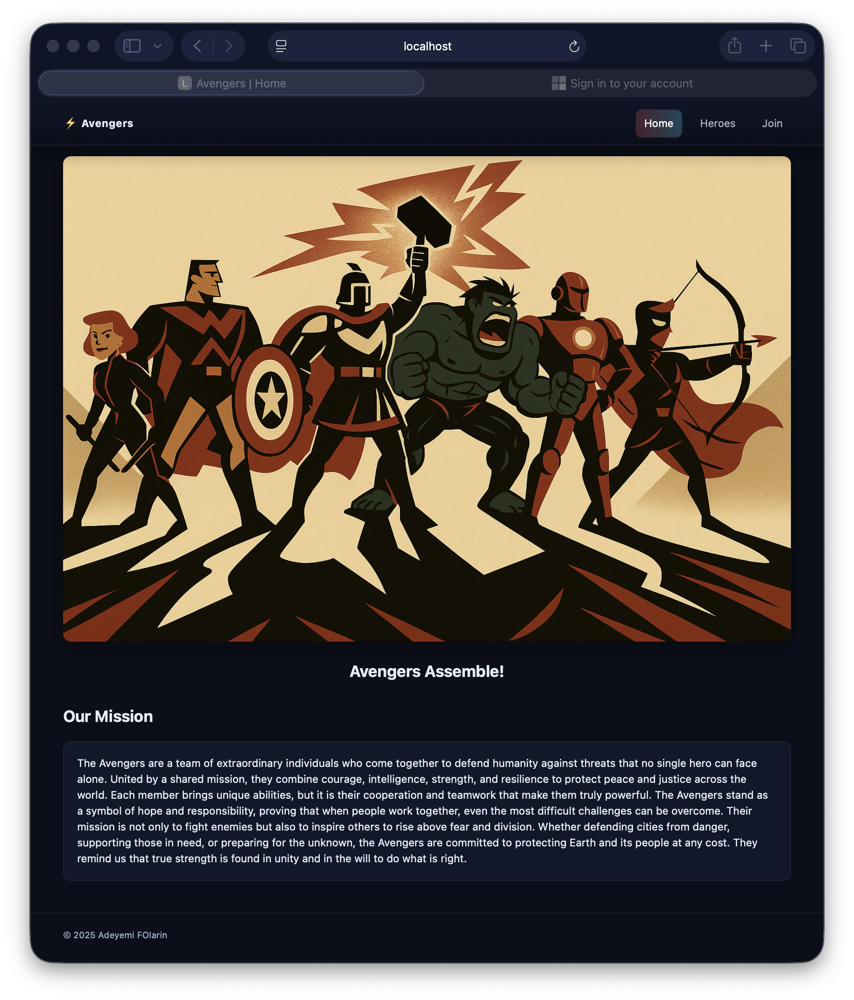
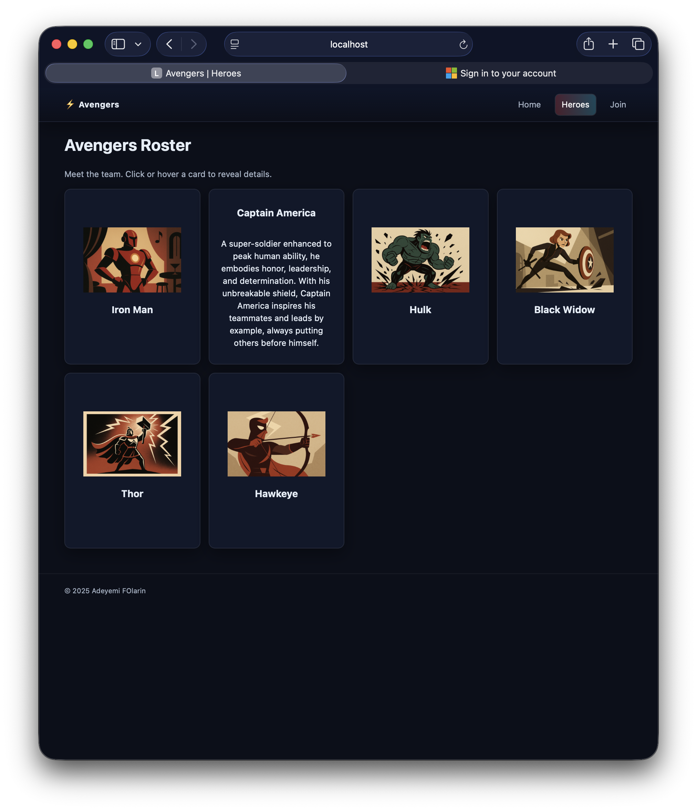
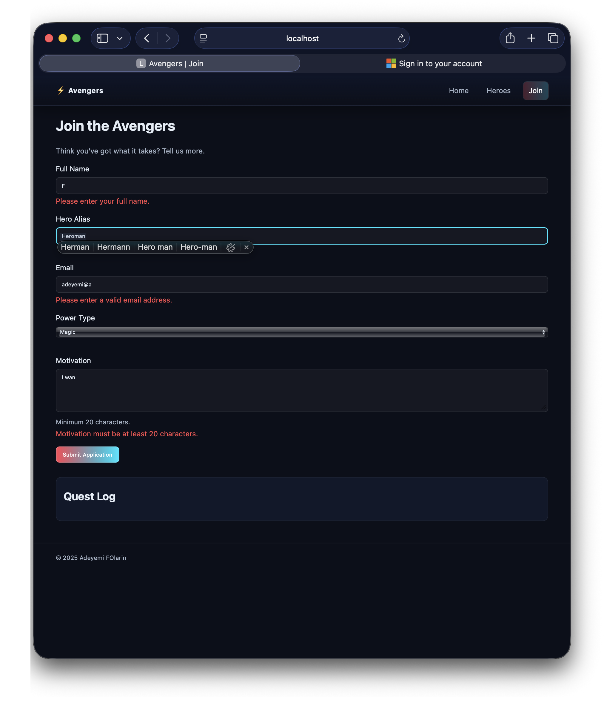
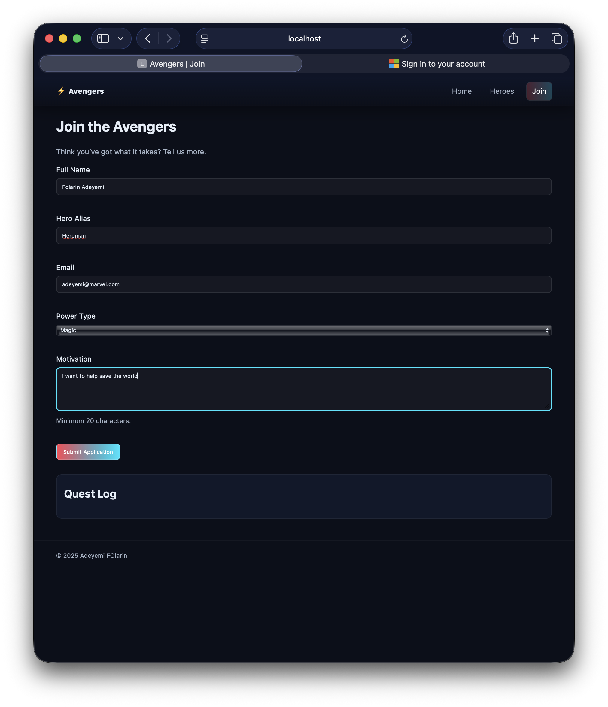
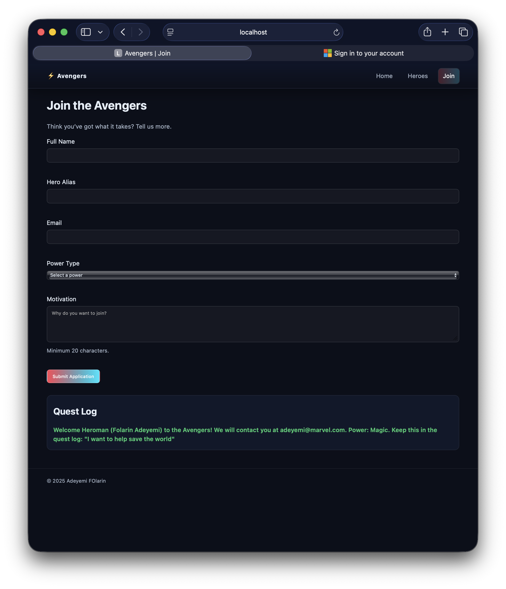

# Assignment 01 Report — Responsive Avengers Website

- Name: Adeyemi Folarin
- Student ID: 123224214
- Date: 29th of September, 2025

---

## Overview

I built a 3‑page, responsive Avengers website with a shared sticky header, a hero profile grid with interactive flip cards, and a Join form that validates input on the client side. I focused on semantic HTML, accessible interactions, and a consistent look and feel using CSS custom properties.

## How To View

- Open `assignment01/index.html` in a browser.
- Use the navbar to visit `heroes.html` and `join.html`.

## Screenshots

Screenshots are stored in `assignment01/img/` and embedded below:

- Homepage — index

  

- Heroes — grid and interactions

  

- Join — incorrect/invalid form state

  

- Join — corrected/valid form state

  

- Join — submitted with confirmation message

  

## Validation & UX Summary

- Validates: Full Name, Alias, Email, Power Type (select), Motivation (min length 20).
- Shows inline error messages on input/blur and prevents submission until all fields are valid.
- On success, appends a confirmation message to the quest log and resets the form.
- Keyboard‑friendly interactions across the site; visible focus styles for interactive elements.

## Reflection

What I built and key decisions
- I created three pages with a navigation bar at the top that stays in place when you scroll. The Heroes page has cards that flip over when you click them to show more information. The Join form checks if everything is filled out correctly before letting you submit.

Responsive design
- I used CSS Grid for the hero cards so they automatically adjust from one column on phones to multiple columns on bigger screens. I tested it by resizing my browser window.

Accessibility considerations
- I added alt text to all the images so screen readers can describe them. I made sure you can use Tab and Enter to navigate and flip the cards without a mouse. For the form, I added error messages that appear when something's wrong.

Challenges and solutions
- Getting the card flip to work with both mouse clicks and keyboard was tricky. I had to add event listeners for clicks and also for the Enter and Space keys. For form validation, I learned how to check if fields are empty and show error messages. The hardest part was making sure the error messages appeared and disappeared at the right times.

What I’d improve next
- I want to add more validation checks, like making sure the email actually looks like an email. I also want to show all the errors at once instead of one at a time, and maybe save what the user typed so they don't lose it if they refresh the page.

## Notes

- Images and character references are for educational use only.
