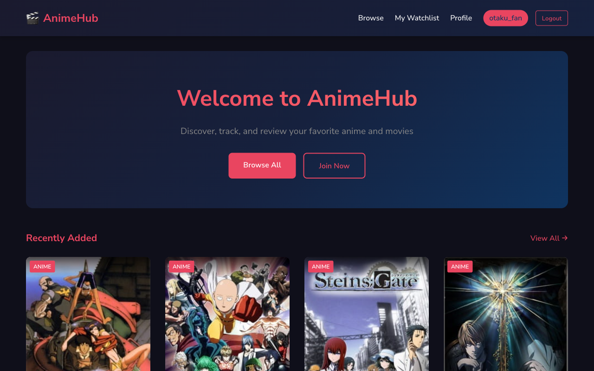
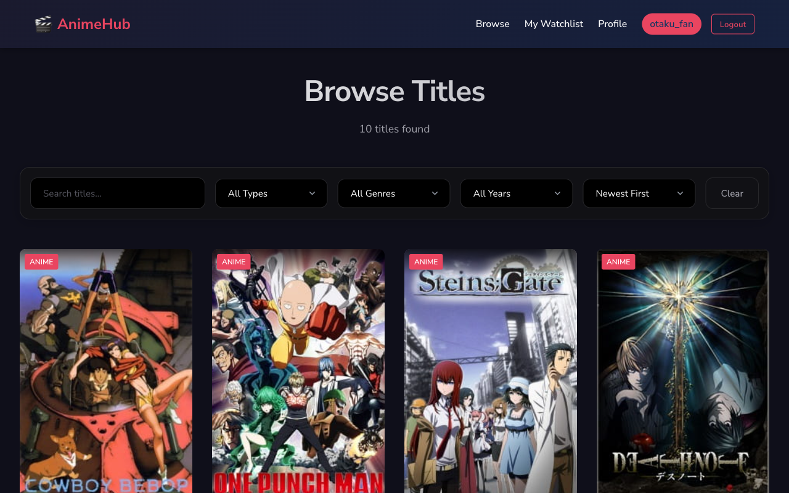
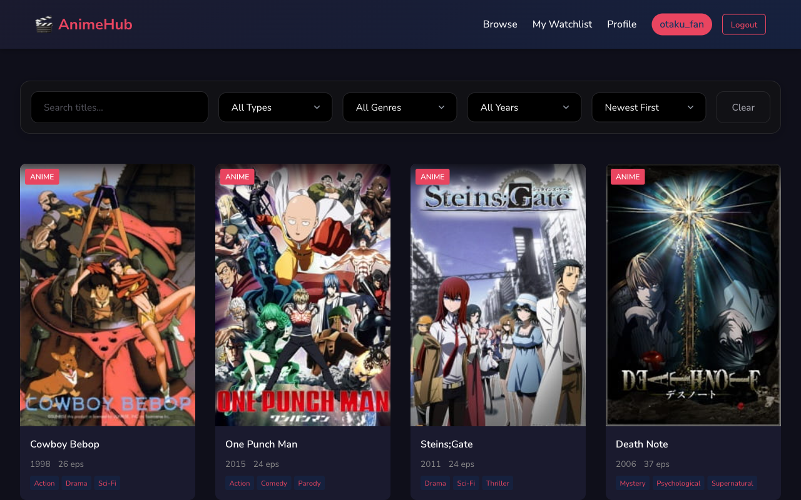
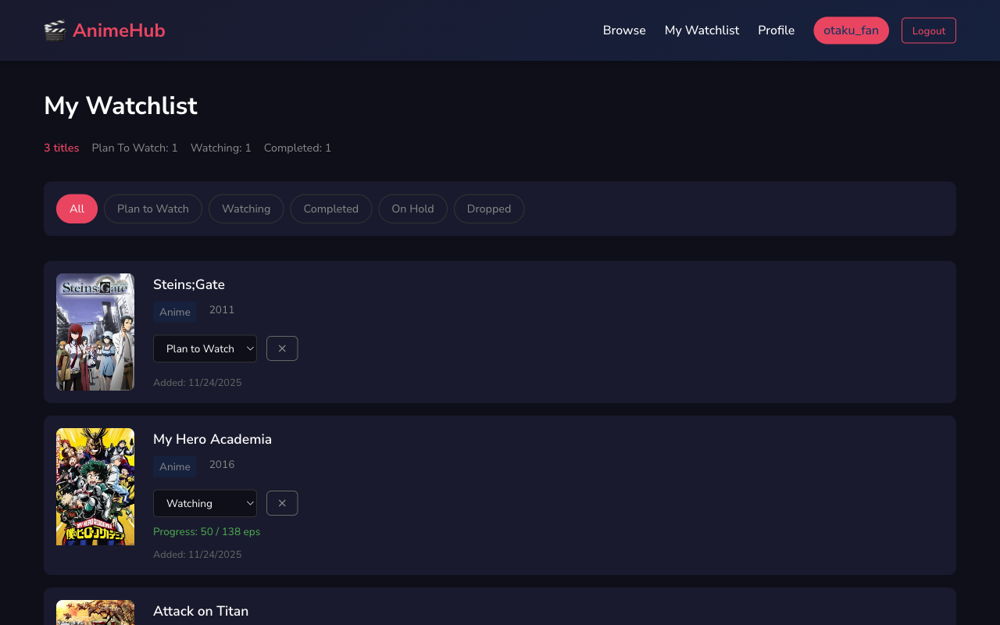
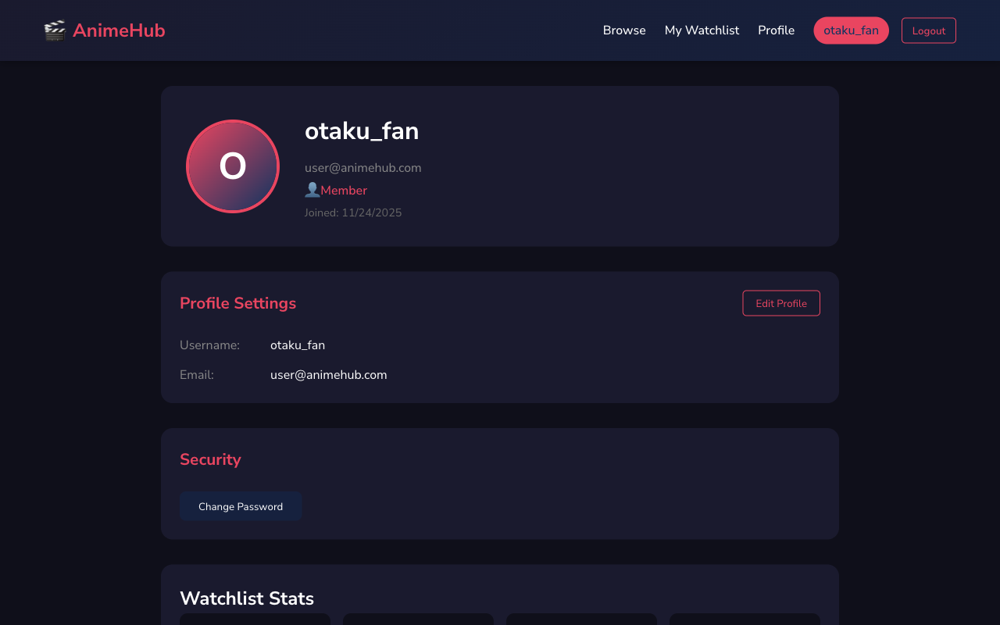

# Assignment 02: Anime/Movie Recommendation Hub

**Course**: SRT551 - Full Stack Web Development  
**Student**: [Your Name]  
**Date**: [Submission Date]

---

## 1. Application Overview

AnimeHub is a full-stack web application for discovering, tracking, and reviewing anime and movies. Users can browse titles, manage personal watchlists, rate content, and engage with the community through reviews.

### Key Features

- Browse anime and movies with search, filtering, and pagination
- User authentication (register, login, JWT-based sessions)
- Personal watchlist with status tracking (watching, completed, plan to watch, etc.)
- Rating and review system
- Responsive design for mobile and desktop
- Accessible UI with keyboard navigation and screen reader support

---

## 2. Architecture

### Tech Stack

| Layer | Technology |
|-------|------------|
| Frontend | React 18 (Vite), React Router v6, Axios |
| Backend | Node.js, Express.js |
| Database | MongoDB with Mongoose ODM |
| Authentication | JWT (JSON Web Tokens), bcrypt |
| Security | Helmet, CORS, express-validator |

### System Architecture

```
┌─────────────────┐     HTTP/REST      ┌─────────────────┐     Mongoose     ┌─────────────────┐
│                 │ ◄──────────────────►│                 │ ◄───────────────►│                 │
│  React Client   │     JSON + JWT      │  Express API    │                  │    MongoDB      │
│  (Port 5173)    │                     │  (Port 5000)    │                  │                 │
└─────────────────┘                     └─────────────────┘                  └─────────────────┘
```

---

## 3. Data Model (ERD)

```
┌───────────────────┐       ┌───────────────────┐
│       USERS       │       │      TITLES       │
├───────────────────┤       ├───────────────────┤
│ _id: ObjectId     │       │ _id: ObjectId     │
│ email: String     │       │ name: String      │
│ passwordHash: Str │       │ type: String      │
│ username: String  │       │ genres: [String]  │
│ role: String      │       │ year: Number      │
│ avatar: String    │       │ synopsis: String  │
│ createdAt: Date   │       │ poster: String    │
└────────┬──────────┘       │ episodes: Number  │
         │                  │ status: String    │
         │                  │ studio: String    │
         │                  │ rating: {avg,cnt} │
         │                  │ createdBy: ObjId  │
         │                  └────────┬──────────┘
         │                           │
         │    ┌──────────────────────┼──────────────────────┐
         │    │                      │                      │
         ▼    ▼                      ▼                      │
┌───────────────────┐       ┌───────────────────┐           │
│     REVIEWS       │       │    WATCHLISTS     │           │
├───────────────────┤       ├───────────────────┤           │
│ _id: ObjectId     │       │ _id: ObjectId     │           │
│ userId: ObjectId  │───┐   │ userId: ObjectId  │───────────┘
│ titleId: ObjectId │───┼──►│ items: [{        │
│ rating: Number    │   │   │   titleId: ObjId │
│ text: String      │   │   │   status: String │
│ likes: Number     │   │   │   progress: Num  │
│ createdAt: Date   │   │   │   addedAt: Date  │
└───────────────────┘   │   │ }]               │
                        │   └───────────────────┘
                        │
              Foreign Key References
```

### Relationships

| Relationship | Type | Description |
|--------------|------|-------------|
| User → Reviews | 1:N | One user can write many reviews |
| User → Watchlist | 1:1 | Each user has one watchlist document |
| Title → Reviews | 1:N | One title can have many reviews |
| Watchlist → Titles | N:M | Watchlist contains many title references |

### Indexes

- `users`: email (unique), username (unique)
- `titles`: text index on (name, synopsis), genres, type, year, rating.average
- `reviews`: compound (userId, titleId) unique, titleId + createdAt
- `watchlists`: userId (unique)

---

## 4. API Documentation

### Base URL
```
http://localhost:5000/api
```

### Authentication

All protected endpoints require:
```
Authorization: Bearer <jwt_token>
```

### Endpoints Summary

#### Auth (`/api/auth`)
| Method | Endpoint | Body | Response |
|--------|----------|------|----------|
| POST | /register | {email, password, username} | {user, token} |
| POST | /login | {email, password} | {user, token} |
| GET | /me | - | {user} |
| PUT | /me | {username?, avatar?} | {user} |
| PUT | /password | {currentPassword, newPassword} | {token} |

#### Titles (`/api/titles`)
| Method | Endpoint | Query Params | Response |
|--------|----------|--------------|----------|
| GET | / | page, limit, sort, type, genre, year, search, minRating | {data[], pagination} |
| GET | /:id | - | {data} |
| GET | /genres | - | {data[]} |
| GET | /top-rated | limit, type | {data[]} |
| POST | / | {name, type, genres, year, synopsis, ...} | {data} |
| PUT | /:id | {partial updates} | {data} |
| DELETE | /:id | - | {message} |

#### Reviews (`/api/reviews`)
| Method | Endpoint | Body/Query | Response |
|--------|----------|------------|----------|
| GET | / | titleId?, userId?, page, limit | {data[], pagination} |
| GET | /:id | - | {data} |
| GET | /my/:titleId | - | {data} |
| POST | / | {titleId, rating, text?} | {data} |
| PUT | /:id | {rating?, text?} | {data} |
| DELETE | /:id | - | {message} |

#### Watchlist (`/api/watchlist`)
| Method | Endpoint | Body | Response |
|--------|----------|------|----------|
| GET | / | status? | {data, pagination} |
| GET | /stats | - | {total, byStatus} |
| GET | /check/:titleId | - | {inWatchlist, item} |
| POST | / | {titleId, status?} | {data} |
| PUT | /:titleId | {status?, progress?} | {data} |
| DELETE | /:titleId | - | {message} |

### Error Response Format
```json
{
  "success": false,
  "message": "Error description",
  "errors": [{"field": "email", "message": "Invalid email"}]
}
```

---

## 5. Screenshots


### Home Page

*Landing page with top-rated and recently added titles*

### Browse Page

*Searchable, filterable grid of all titles*

### Title Details

*Full information, reviews, and watchlist actions*

### Watchlist

*Personal watchlist with status management*

### Profile

*User settings and statistics*

---

## 6. Setup Instructions

### Prerequisites
- Node.js 18+
- MongoDB (local or Atlas)
- npm or yarn

### Backend Setup

```bash
cd server

# Install dependencies
npm install

# Create environment file
cp .env.example .env

# Edit .env with your MongoDB URI and JWT secret
# MONGODB_URI=mongodb://localhost:27017/animehub
# JWT_SECRET=your_secure_secret_here

# Seed database with sample data
npm run seed

# Start development server
npm run dev
```

Server runs at: http://localhost:5000

### Frontend Setup

```bash
cd client

# Install dependencies
npm install

# Create environment file
cp .env.example .env

# Start development server
npm run dev
```

Client runs at: http://localhost:5173

### Test Accounts (after seeding)

| Email | Password | Role |
|-------|----------|------|
| admin@animehub.com | password123 | Admin |
| user@animehub.com | password123 | User |
| reviewer@animehub.com | password123 | User |

---

## 7. Project Structure

```
assignment02/
├── client/                    # React frontend
│   ├── src/
│   │   ├── components/        # Reusable UI components
│   │   │   ├── Navbar.jsx
│   │   │   ├── TitleCard.jsx
│   │   │   ├── Loading.jsx
│   │   │   ├── Pagination.jsx
│   │   │   └── ProtectedRoute.jsx
│   │   ├── context/           # React Context
│   │   │   └── AuthContext.jsx
│   │   ├── pages/             # Route components
│   │   │   ├── Home.jsx
│   │   │   ├── Browse.jsx
│   │   │   ├── TitleDetails.jsx
│   │   │   ├── Login.jsx
│   │   │   ├── Register.jsx
│   │   │   ├── Watchlist.jsx
│   │   │   └── Profile.jsx
│   │   ├── services/          # API client
│   │   │   └── api.js
│   │   ├── App.jsx
│   │   └── main.jsx
│   ├── package.json
│   └── .env.example
│
├── server/                    # Express backend
│   ├── config/
│   │   └── db.js
│   ├── controllers/
│   │   ├── authController.js
│   │   ├── titleController.js
│   │   ├── reviewController.js
│   │   └── watchlistController.js
│   ├── middleware/
│   │   ├── auth.js
│   │   ├── errorHandler.js
│   │   └── validation.js
│   ├── models/
│   │   ├── User.js
│   │   ├── Title.js
│   │   ├── Review.js
│   │   └── Watchlist.js
│   ├── routes/
│   │   ├── authRoutes.js
│   │   ├── titleRoutes.js
│   │   ├── reviewRoutes.js
│   │   └── watchlistRoutes.js
│   ├── seed/
│   │   └── index.js
│   ├── app.js
│   ├── package.json
│   └── .env.example
│
└── report02.md               # This file
```

---

## 8. Reflection

### Challenges Faced

1. **JWT Token Management**: Implementing proper token refresh and handling expired sessions required careful coordination between the frontend interceptors and backend middleware.

2. **Rating Calculation**: Keeping the aggregate rating in sync when reviews are created, updated, or deleted required Mongoose middleware hooks and careful transaction handling.

3. **Watchlist Status Updates**: Managing the embedded array of watchlist items while maintaining good UX for status updates required optimistic UI updates.

### Lessons Learned

1. **Component Architecture**: Breaking down the UI into small, reusable components (TitleCard, Pagination, Loading) significantly improved code maintainability and reduced duplication.

2. **Error Handling**: Implementing a centralized error handler on the backend and consistent error responses made frontend error handling much cleaner.

3. **State Management**: Using React Context for authentication state proved sufficient for this application's needs, avoiding the complexity of Redux.

### Future Improvements

- Add image upload for user avatars and title posters
- Implement real-time notifications for new reviews
- Add social features (following users, activity feed)
- Deploy to cloud platform (Vercel + Railway/Render)
- Add recommendation engine based on user preferences

---

## 9. References

- [Express.js Documentation](https://expressjs.com/)
- [Mongoose Documentation](https://mongoosejs.com/docs/)
- [React Router Documentation](https://reactrouter.com/)
- [JWT.io](https://jwt.io/)
- [Vite Documentation](https://vitejs.dev/)

---

## 10. Declaration

I declare that this submission is my own work and that all sources used have been properly acknowledged. I understand that plagiarism and collusion are serious academic offenses.

**Signature**: _______________  
**Date**: _______________
