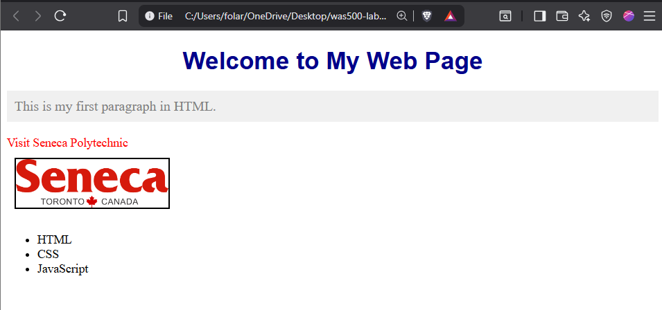

# **Title: Lab 1**

- **Name**: Abdul-Ramon Adeyemi Folarin
- **Student ID**: 123224214

**Table of Contents**

1. [Introduction](https://github.com/yuhui-feng_seneca/WAS500-LABS/blob/main/report_template.md#introduction)
2. [Screenshots](https://github.com/yuhui-feng_seneca/WAS500-LABS/blob/main/report_template.md#screenshots)
3. [Experience and Challenges](https://github.com/yuhui-feng_seneca/WAS500-LABS/blob/main/report_template.md#experience-and-challenges)

---

**Introduction**

This is an introductory lab that shows rudimentary web development

**Screenshots Deliverables**

**Deliverable 1: Screenshot of the Website**

**Experience and Challenges**

**Reflection on Completing the Lab**

- **What did you learn?**  I learned a class can have multiple elements, while an id supersedes a class. This means if both are applied to the same element, the `id` styles will override the `class` styles.
- **Challenges Faced**: I initially had problems styling my id and class because i mixed up their identifiers ( # and .)
- **How You Overcame Challenges**:  I rewrote the css to fix this.