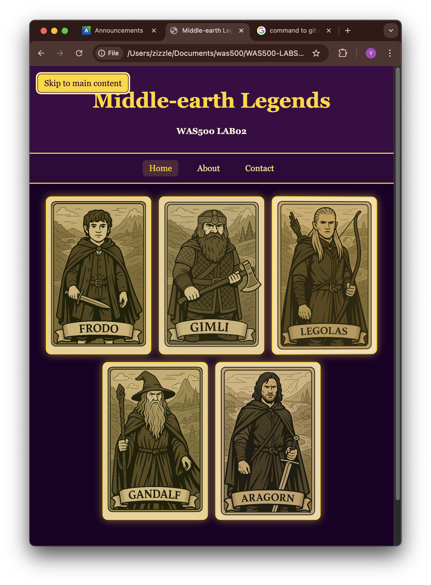

# Lab 02 Report — Responsive Layouts and Accessibility

- Name: Adeyemi Folarin
- Student ID: 123224214
- Date: September 8th, 2025

---

## Overview
This lab implements a semantic, responsive, and accessible character gallery using HTML5 and CSS and the key tasks include a skip-to-content link, a Flexbox navigation bar, a responsive card gallery, and focus/hover states.

---

## Screenshots

### Desktop layout
- Multiple cards per row, centered with consistent gaps and container padding.
- Visible nav row with even spacing.

### Mobile layout
- Single-column cards; nav stacked vertically; skip-link visible on focus.

---

## Implementation Notes

- The skip link is hidden off-screen by default; and clearly visible on focus with contrasting background and outline.
- For the navigation, the flexbox row on desktop has even spacing, stacked and centered on mobile; hover and focus-visible styles added.
- For the card gallery, the flex-wrap has centered content, 1em gaps, and 2em container padding and the cards remain fluid on small screens.
- For the card back, the flex column with centered alignment both vertically and horizontally and inner padding added.
- To make it responsive, the media queries at 900px and 600px adjust spacing, padding, nav orientation, and card sizing to avoid horizontal scroll.

---

## Reflection

### 1) Skip link and navigation improvements
- I placed the skip link as the first focusable element: `<a class="skip-link" href="#main">Skip to main content</a>`.
- I visually hid it off-screen by default using `position: absolute; left: -10000px;` so it remains keyboard-focusable.
- On `:focus`/`:focus-visible`, I made it so it could be brought on-screen with padding, a high-contrast background (`#ffd700`), rounded corners, and an outline/shadow for a clear focus style.
- I built the nav with Flexbox: `.nav-list { display: flex; justify-content: center; gap: 1rem 1.5rem; }` and made links block-level with padding for larger hit targets.
- I also added link states: subtle hover background, strong `:focus-visible` outline, and an active style via `[aria-current="page"]`.
- On small screens, stacked the nav vertically with `flex-direction: column; align-items: center;` so items stay readable and centered.

### 2) Making the layout responsive
- The gallery uses Flexbox wrapping: `.card-container { display: flex; flex-wrap: wrap; justify-content: center; gap: 1em; padding: 2em; }` to center cards with consistent spacing and inner padding.
- I made sure the cards are fluid: `.card { width: min(200px, 100% - 2rem); height: 300px; margin: 0; }` so they shrink on narrow viewports; spacing is handled entirely by `gap`.
- Media queries:
  - `@media (max-width: 900px)`: slightly reduce gap/padding.
  - `@media (max-width: 600px)`: stack nav vertically; set `.card { width: 100%; max-width: 420px; }` to enforce a single-column list without horizontal scroll.
- I applied `box-sizing: border-box;` globally to keep sizing predictable as padding/outline change.
- Card fronts use background images with `background-size: cover` and `background-position: center` to stay visually balanced when cards resize.

### 3) Challenges and solutions
- The skip link was not visible at first on keyboard focus: implemented `:focus/:focus-visible` styles with contrasting background, outline, and z-index to ensure visibility.
- There was uneven spacing between cards due to per-card margins: removed margins from `.card` and used Flexbox `gap` on the container for consistent spacing.
- To fix horizontal scrolling on small screens: I made cards fluid (`width: min(200px, 100% - 2rem)`) and constrained mobile width (`width: 100%; max-width: 420px`) with reduced container padding.
- The navigation was cramped on mobile so i stacked items vertically with Flexbox in a media query and centered them.
- There was a semantic/structure glitch (extra `</header>`): so I removed the stray tag and added `id="main"` so the skip link target works properly.
- Focus visibility for links: I added `:focus-visible` outlines and a subtle hover state to meet accessibility expectations.
