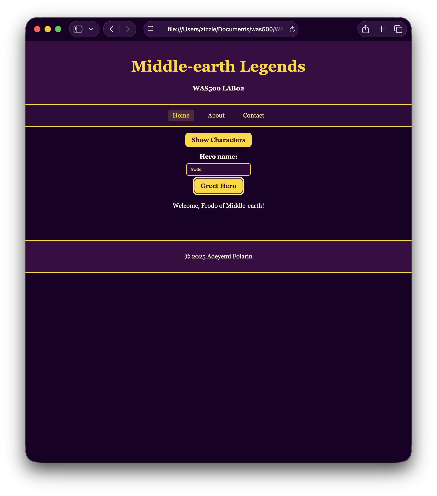

# Lab03 — Interactive Middle‑earth Legends

Use this template to submit your Lab03. Replace the placeholders with your own text and screenshots.

## 1) Screenshots (Checklist)

-  Initial page load: characters visible and button text shows “Hide Characters”.
  
  

-  Characters section hidden after clicking toggle; button text shows “Show Characters”.
  
  

-  Greeting for a valid hero (case‑insensitive). Example tested with “frodo”.
  
  

-  Greeting for an invalid hero.
  
  

## 2) Reflection (30%)

### a) Adapting Lab02’s layout (10%)

- What did you change in the HTML structure to support the JavaScript features (e.g., section wrapper, buttons, inputs)?
 - Wrapped cards: Placed all cards inside #characters to toggle the whole section at once.

 - Main container: Renamed card-container to main-container and made it column‑oriented to stack the grid, toggle, and greeting.

 - Card grid: Moved the flex grid rules to #characters so layout stays intact when toggled.

- Controls: Added #toggleBtn and greeting UI (#heroName, #greetBtn, #greetMsg) below the cards.

- Styling: Added .siteBtn for consistent button look and .greet-area to center inputs; kept colors/spacing from Lab02 for visual consistency.

 - Script load: Linked script.js with defer so elements exist without needing complex event code.

### b) Ensuring features work with different inputs (10%)

 - Blank input: If the input is empty, It shows “Please enter a character name.”

  - Case‑insensitive match: Lowercases the input and checks via simple if/else to map to canonical names (Frodo, Gimli, Legolas, Gandalf, Aragorn).

  - Toggle defaults: Cards are visible by default via CSS; button text starts as “Hide Characters”; clicking updates the style.display and button text.

  - Keyboard access: Enter key activates both the toggle and greeting buttons for basic accessibility.

  - Simplicity: I used var, onclick, and if/else only—no arrays, no arrow functions, no advanced methods.

### c) Challenges and solutions (10%)

  - Keeping layout while toggling: Needed the grid to display correctly after show/hide. Solution: keep #characters grid in CSS and only toggle inline display between flex and none.

  - Correct initial state: Button should say “Hide Characters” while cards are visible. Solution: default grid visible via CSS and set initial button text; first click hides the section.

  - Beginner‑level JS: I avoided arrays and .includes() while still being case‑insensitive. Solution: lowercase input and simple if/else chain to set a canonical name.

  - Script timing: I ensured elements exist without extra code. Solution: use defer on the script tag instead of DOMContentLoaded.

  - Accessibility without complexity: Needed keyboard support and state indication. Solution: role="button", tabindex="0", Enter key handling, and aria-expanded updates on toggle.

## 3) Implementation Notes

  - Cards are wrapped in `<section id="characters">`.

  - A toggle control with id `toggleBtn` shows/hides the entire section.

  - Greeting input `#heroName`, button `#greetBtn`, and message `#greetMsg` display feedback.

  - CSS uses a column‑oriented main container and styles `.siteBtn` with focus states.

## 4) How I Tested

  - Toggled the characters section multiple times and verified the button text updates.

  - Tried blank input, valid heroes (different letter cases), and invalid names.

  - Checked keyboard focus on the buttons and pressed Enter to activate.

## 5) Acceptance Criteria Check

-  On load, cards are visible and button says “Hide Characters”.
-  Toggle hides/shows the characters section.
-  Button text updates correctly.
-  Blank input shows a helpful message.
-  Valid hero input (case‑insensitive) shows a welcome message.
-  Invalid hero input shows a clear message.
-  Buttons are keyboard accessible with visible focus styles.
-  Inputs are labeled and the page remains responsive.