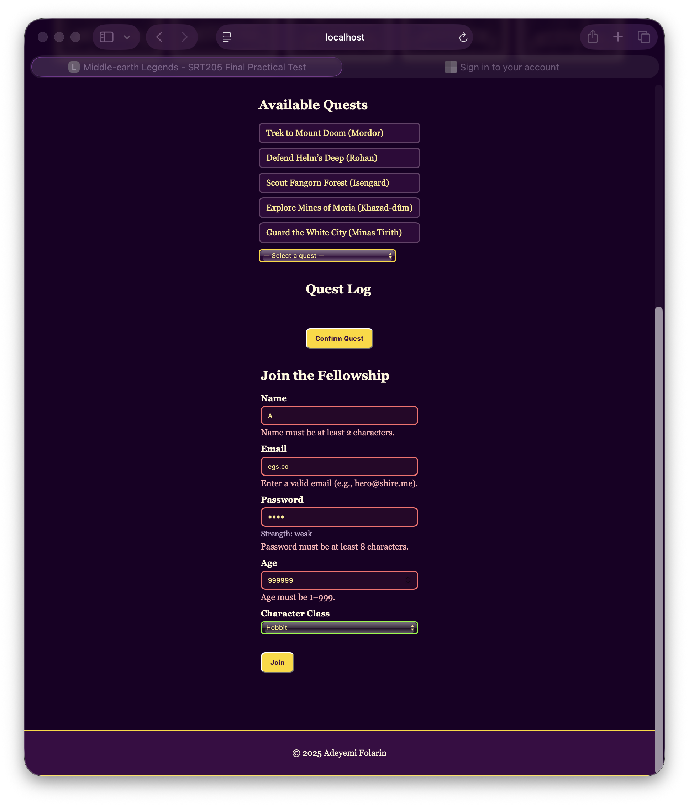
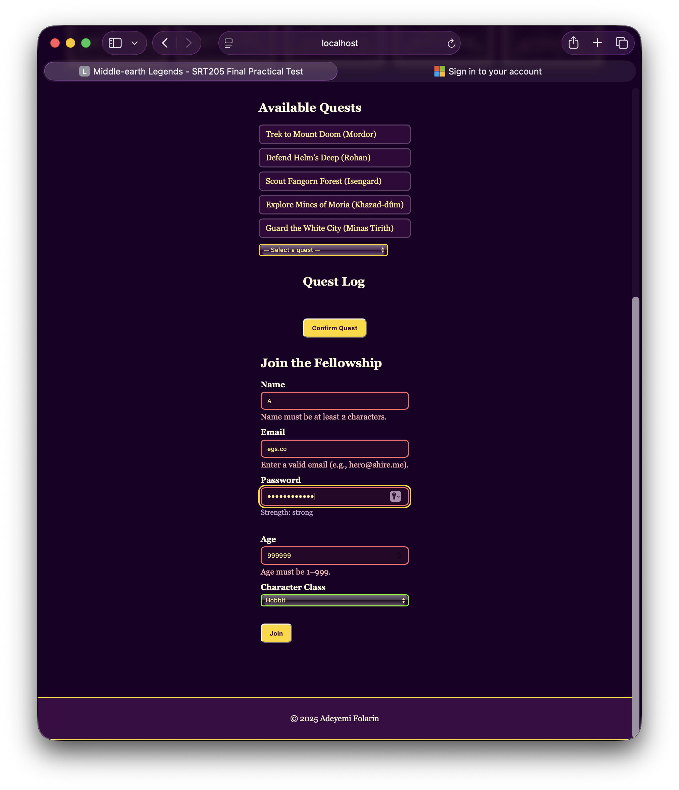
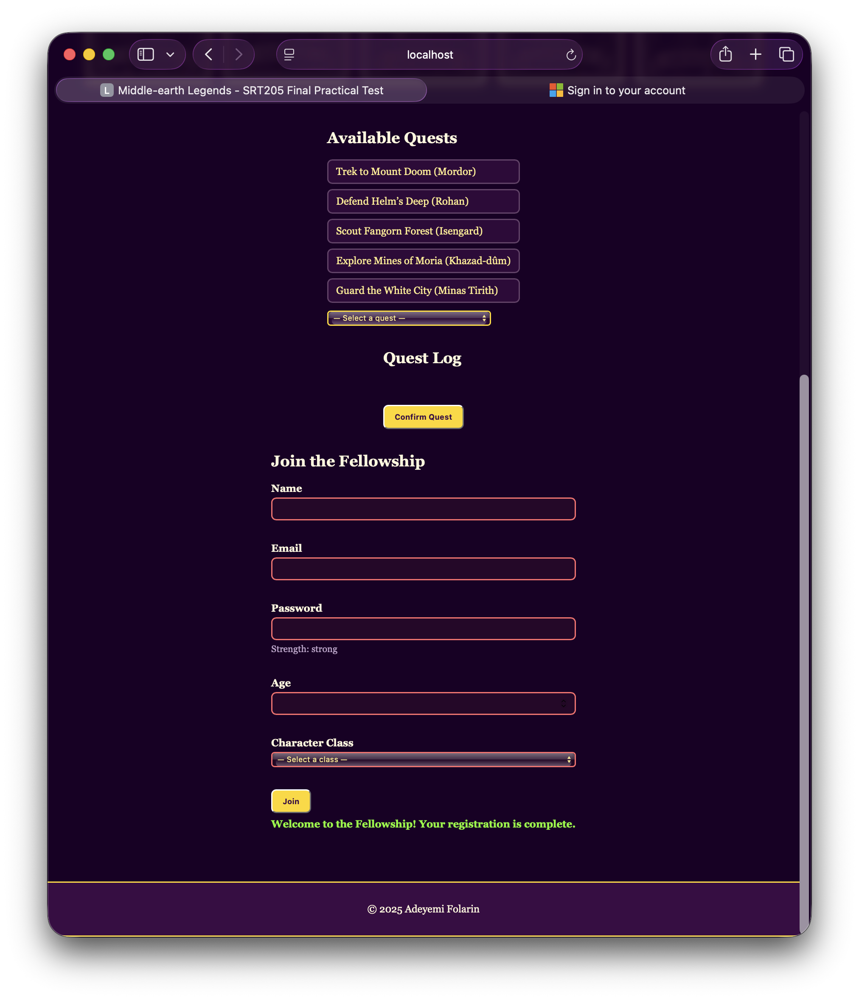

# Lab05 Report — Client-Side Form Validation & UX

- Name: Adeyemi Folarin
- Student ID: 123224214
- Date: 29th of September, 2025

---
## Screenshots

- Form with errors shown

- Real-time feedback in action

- Form successfully submitted

## Reflection

- How did you combine HTML5 and JS validation?
  - I used HTML5 attributes (`required`, `type`, `minlength`, `min`, `max`, `pattern`) for baseline rules and :valid/:invalid styling. Added custom JS to provide friendly, field-specific errors, real-time feedback, and to prevent submission when any field is invalid.

- What UX improvements did you make?
  - I used clear labels, inline error messages with `aria-live`, focus management on first invalid field, unobtrusive success message, and password strength hints while typing. Inputs change styling on valid/invalid to guide the user.

- How would you apply these patterns in a real project?
  - I could create a reusable validation function that builds on the native HTML5 validation, keep all error messages in one place for easier updates, add support for multiple languages, and pair it with server-side validation to make it production-ready.
