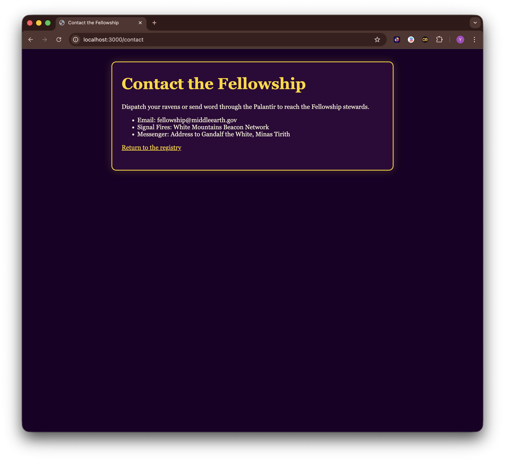

# Lab 06 Report - Node.js Server, File I/O, and Routing

- Name: Adeyemi Folarin
- Student ID: 123224214
- Date: 10th of October, 2025

---
## Screenshots

- Terminal output showing Node.js and npm versions

- Homepage served from the Node server at `http://localhost:3000`

- `/about` or `/contact` route rendered from the Node server

- Network tab showing a failed `/api/join` submission (HTTP 400)

Network tab showing a successful `/api/join` submission (HTTP 200)

- Updated `data/fellowship.json` after a successful submission

## Reflection Notes
1. How did you adapt the Lab05 client-side experience to work with the Lab06 server?
    I kept the form and client-side validation the same. The main change was that instead of just showing a success message on the page, the form now sends data to the server via POST. The server validates it, saves it to a JSON file, and sends back a response. My JavaScript handles that response and displays the result to the user.

2. What changed between client-side and server-side validation?
    Client-side validation gives instant feedback but can be bypassed. Server-side validation is the real check as it doesn't trust the client and rejects bad data before saving. I do both: the client validates for a better experience, but the server is what actually protects the data.

3. What would you improve next if you migrated to Express or another framework?
    I'd use Express routing instead of if/else statements. I'd use middleware to handle POST body parsing automatically instead of listening to data and end events. I'd probably use a templating engine to generate pages dynamically instead of returning hardcoded HTML strings.

