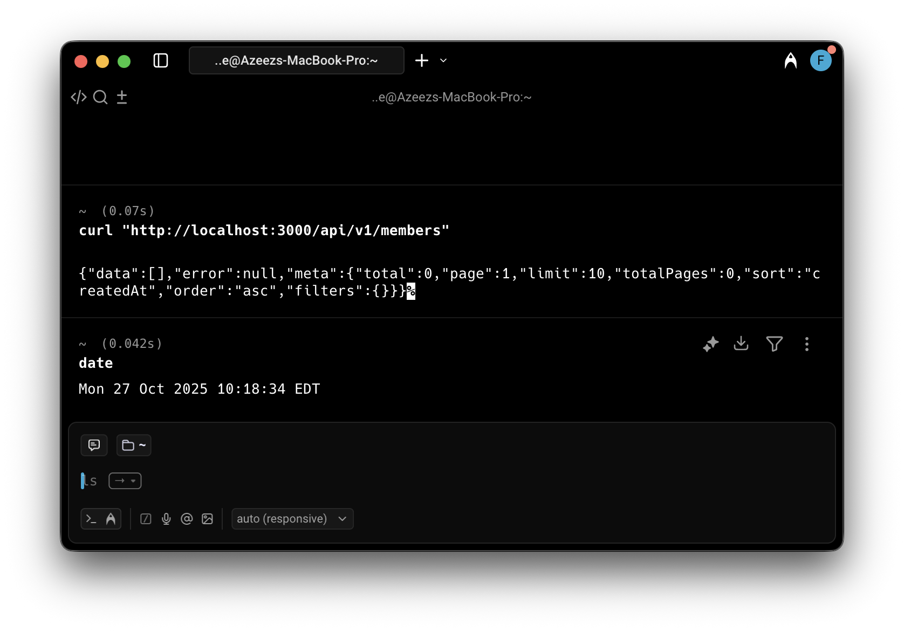
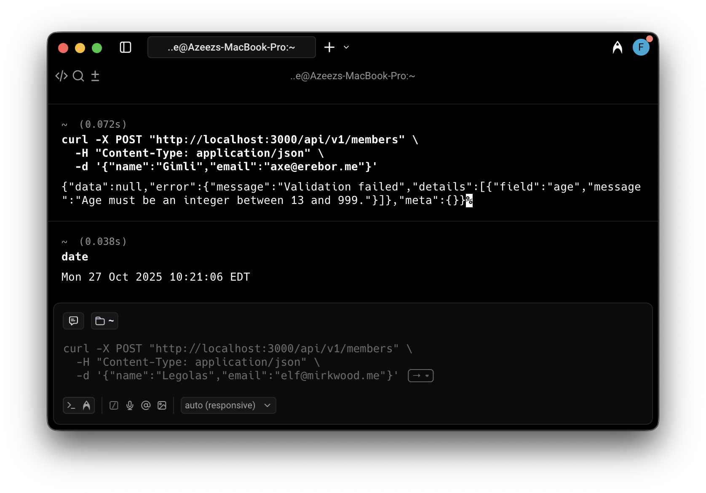
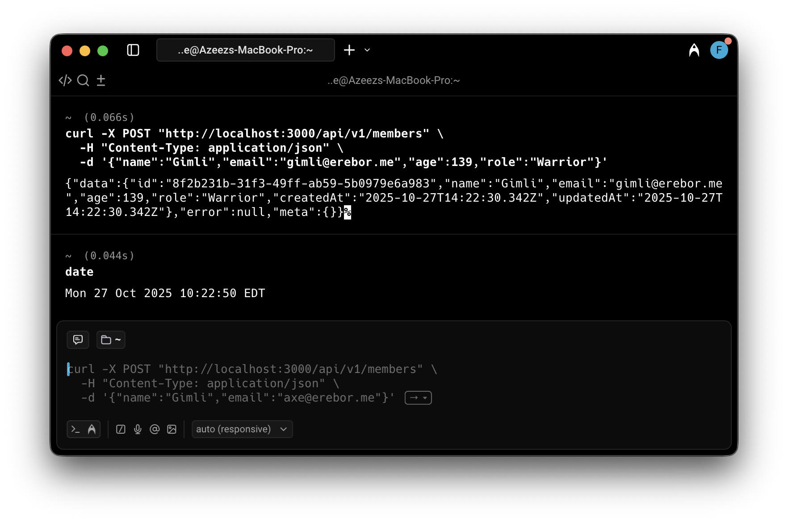
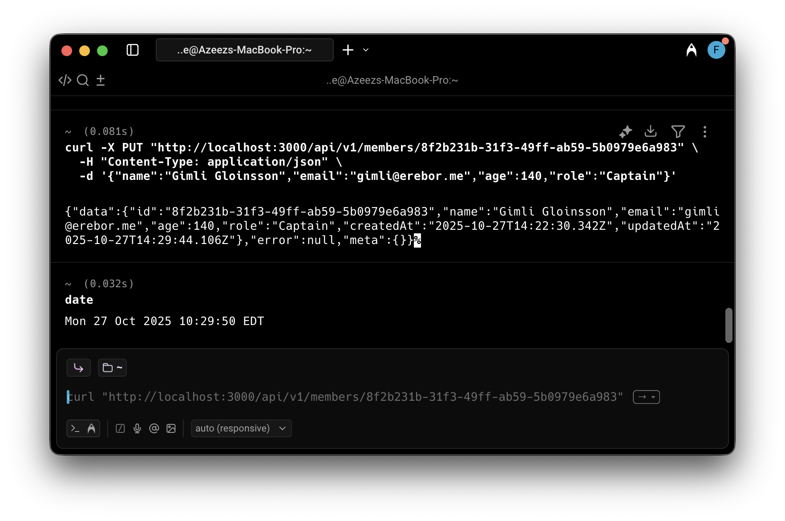
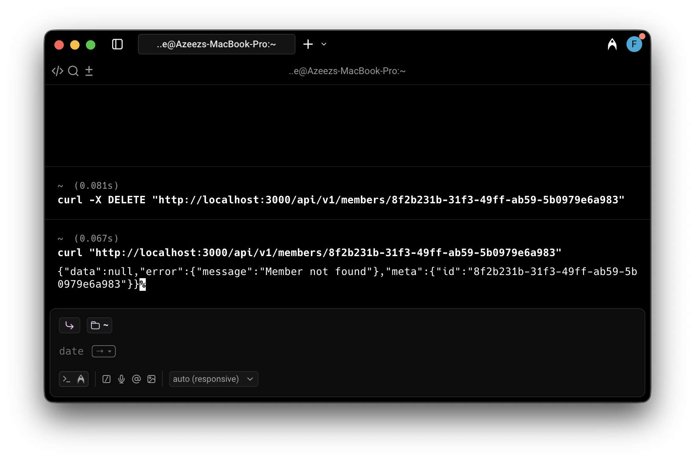
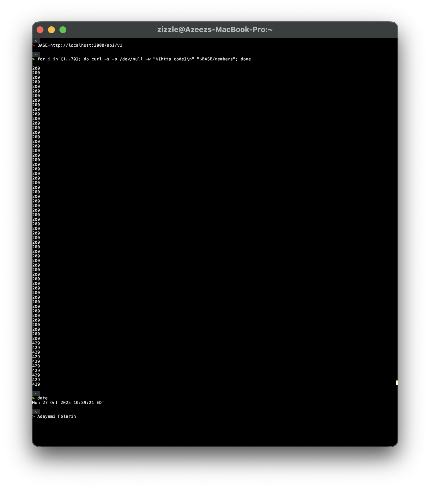

## Lab 07 Report — Fellowship Registry API

- Name: Adeyemi Folarin
- Student ID: 123224214
- Date: 10th of October, 2025

---

### 1. curl Evidence

- Showing the initial empty dataset

- Invalid POST due to missing Age 

- POST valid (201)

GET list with query (page/sort/pagination)

- GET by id

- PUT update (full replace)

GET after delete returning 204 and 404

- Rate limit returning `429`

### 2. Reflection
- **Express vs. manual Node server:**  
  Moving from the raw Node server in Lab06 to Express felt like stepping out of a cave. With Express I finally stopped writing sprawling `if` chains just to juggle routes—the router modules keep everything scoped, and middleware lets me drop shared behaviors (helmet, CORS, logging, validation) exactly where they belong. The biggest win was `express-validator`; chaining the body and query rules right next to the routes is cleaner than all the manual parsing and `try/catch` blocks I used to sprinkle around. Centralized error handling also means I return the same `{data,error,meta}` structure no matter what goes wrong, which was painful to guarantee in the old server.

- **Next improvements:**  
  Now that the API is shaped properly, I want to wire it into MongoDB with Mongoose so the `members.json` file finally retires. I also want to add a simple auth layer—probably JWT or session-based—so only trusted callers can update member data. On top of that, I plan to introduce Jest + Supertest integration tests covering at least the happy path and validation failures; that will give me confidence to refactor without breaking the contract, and it sets me up for a CI pipeline in the next iteration.

### 3. Notes
- I used `BASE=http://localhost:3000/api/v1` for the last curl screenshot because I couldn’t get it to run correctly any other way.
