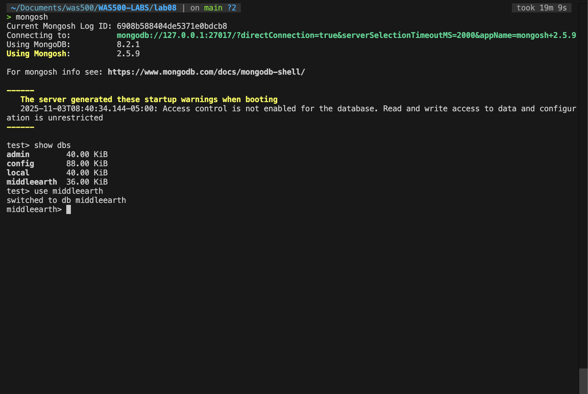
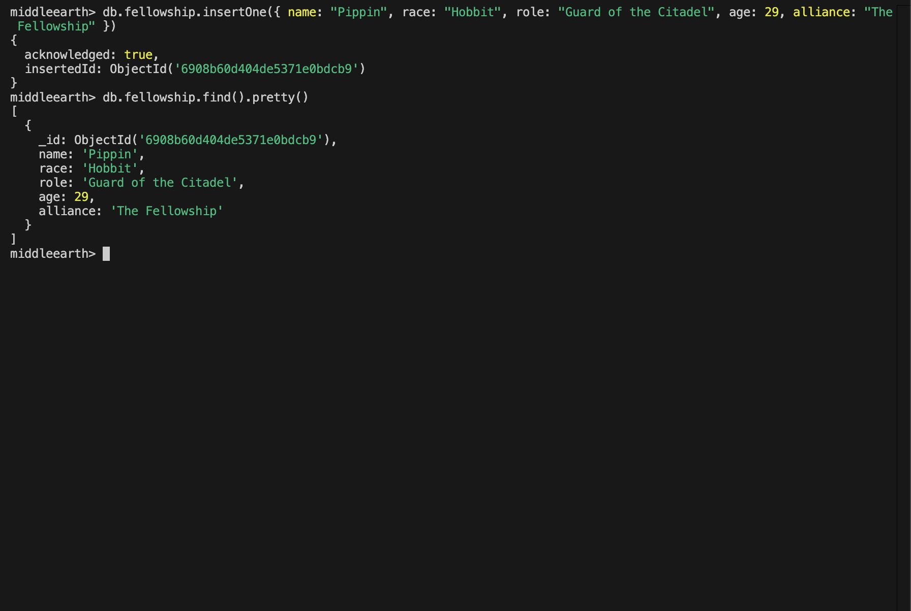
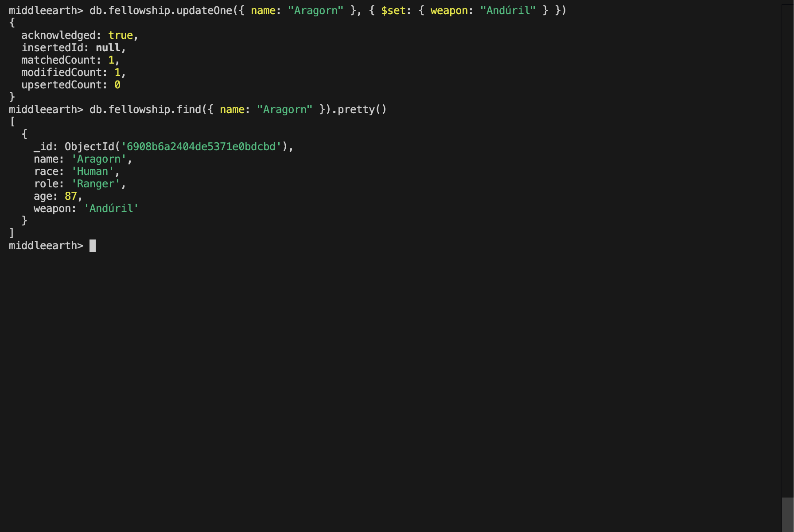
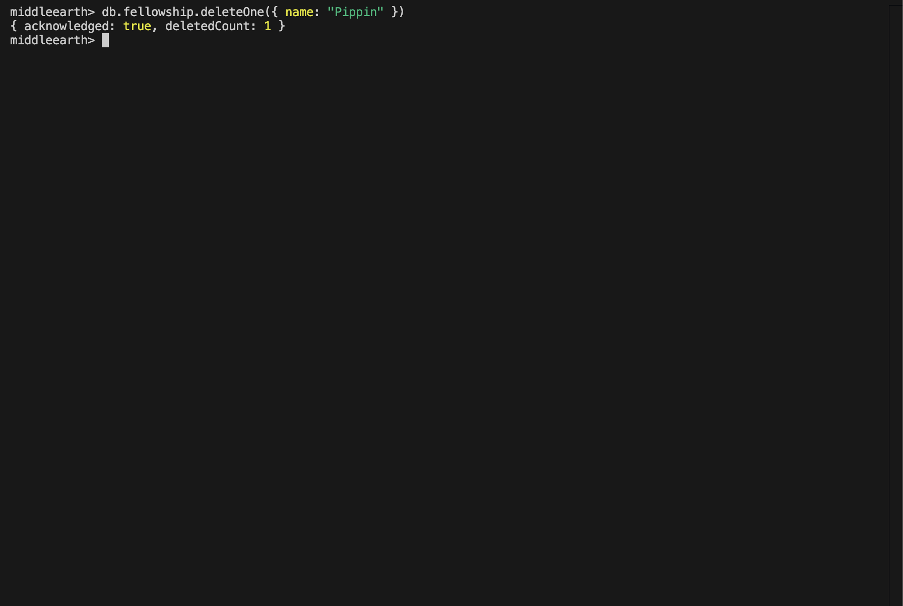
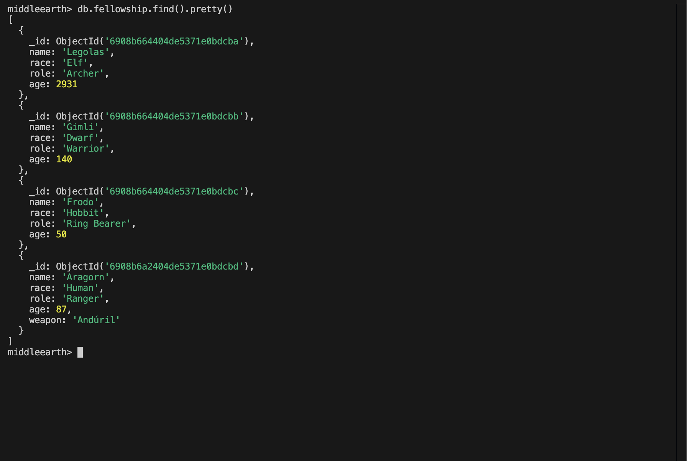

# Lab 08 Report – MongoDB & Data Persistence

- Name: Adeyemi Folarin
- Student ID: 123224214
- Date: 3rd of November, 2025

### Database Setup Evidence
- Run:
  - `mongosh`
  - `show dbs`
  - `use middleearth`
  - `show collections`

    

### CRUD Operations (Shell)
- **Create Operation** 
  This was achived by running `db.fellowship.insertOne({ name: "Pippin", race: "Hobbit", role: "Guard of the Citadel", age: 29, alliance: "The Fellowship" })` 
- **Read Operation** 
  This was achived by running `db.fellowship.find().pretty()`
     

- **Update Operation**
  This was achived by running `db.fellowship.updateOne({ name: "Aragorn" }, { $set: { weapon: "Andúril" } })` followed immediately by `db.fellowship.find({ name: "Aragorn" }).pretty()`
     

- **Delete Operation**
  This was achived by running `db.fellowship.deleteOne({ name: "Pippin" })` to clean up the record inserted for the Create operation.
     

### Data Consistency & Structure
- I then ran `db.fellowship.find().pretty()` one final time to show the resulting documents with `_id`, `name`, `race`, `role`, `age`, `alliance`, and the custom `weapon` field on Aragorn.
     `

## Reflection

1. **MongoDB vs. a flat JSON file:** Working with MongoDB felt much more fluid than editing a static JSON file. The shell let me insert, query, and tweak individual documents without reloading an entire dataset, and MongoDB handled concurrency, validation errors, and indexing. I also appreciated the built-in `_id` keys and the ability to run expressive queries instead of writing manual search logic.

2. **Flexible documents vs. fixed schemas:** The flexible schema made it easy to add new fields like `weapon` to a single hero without breaking the rest of the data. At the same time, I still had to stay disciplined about field names and types so the collection stays predictable. Compared to a relational schema, I gained speed and adaptability, but I’ll need conventions or validation rules once the project grows.

3. **Looking ahead to Express integration:** When the API connects to MongoDB next week, I expect to replace file-based read/write code with MongoDB driver calls, handle asynchronous database operations, and move secrets like the connection string into environment variables. It will also be a good moment to think about modeling the data in Mongoose (or similar) and adding validation so the flexibility remains safe in a multi-route Express app.
