# Lab 09 Report – Full-Stack Integration

- Name: Adeyemi Folarin
- Student ID: 123224214
- Date: November 17, 2025

## Evidence

### 1. Server & Database Setup

**Server Start**
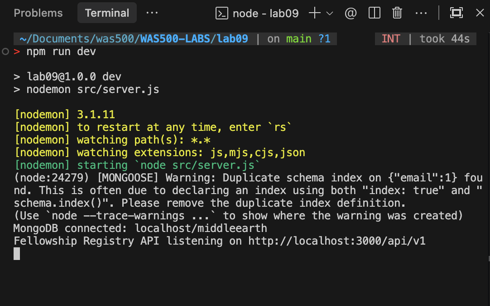

**MongoDB Compass (Members Collection)**
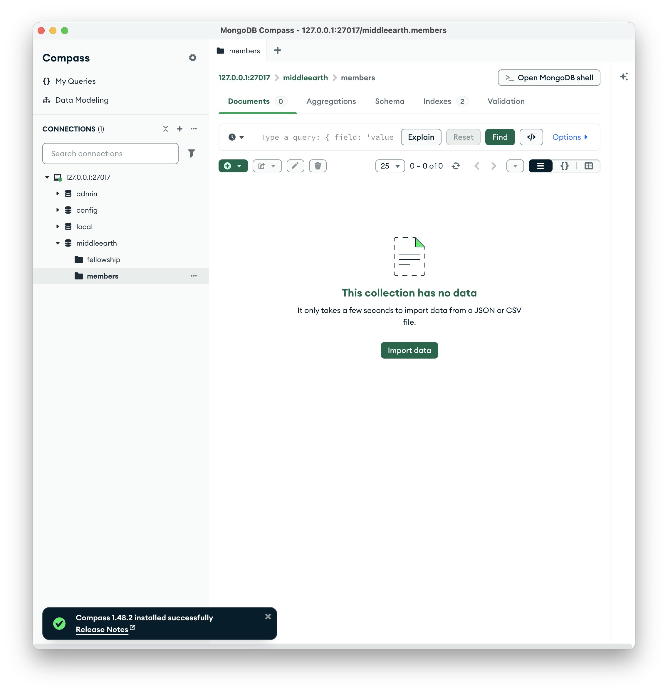

### 2. Backend API Testing (Postman)

**Empty List (GET)**
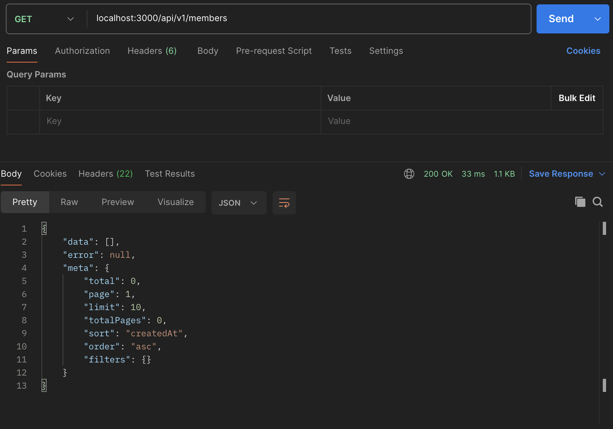

**Invalid POST (Validation Error)**
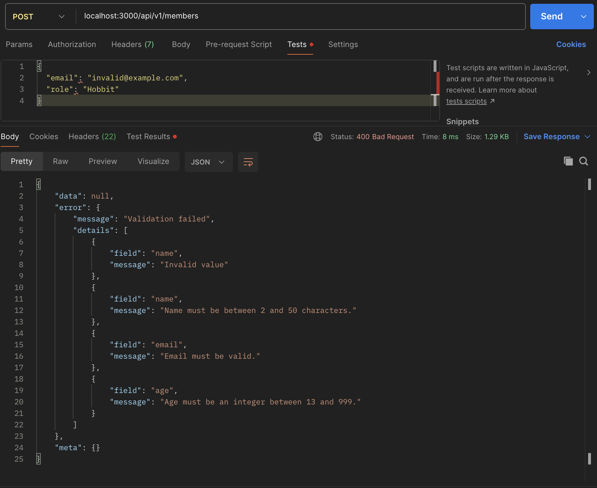

**Valid POST (Registration)**
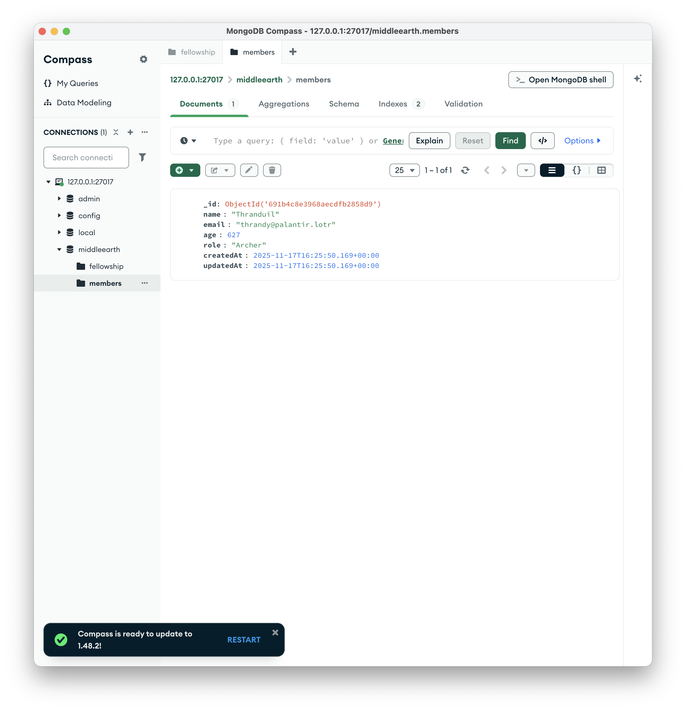

**Get Detail (GET :id)**
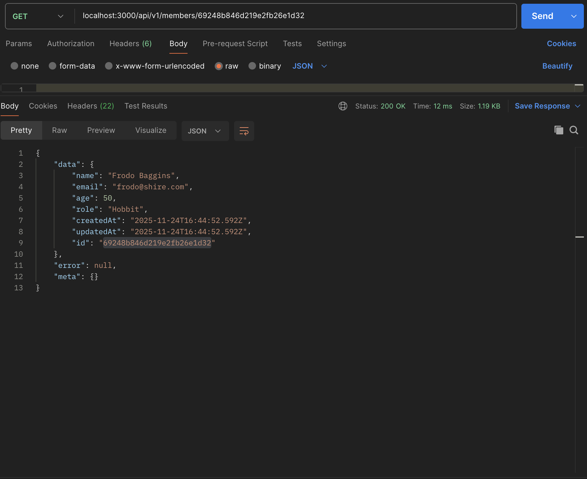

**Update Member (PUT)**
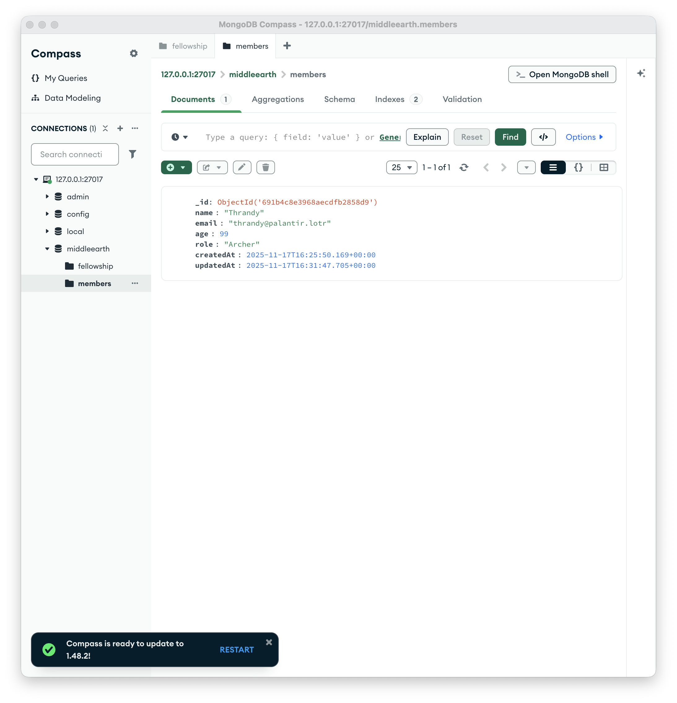

**Duplicate Email (409 Conflict)**
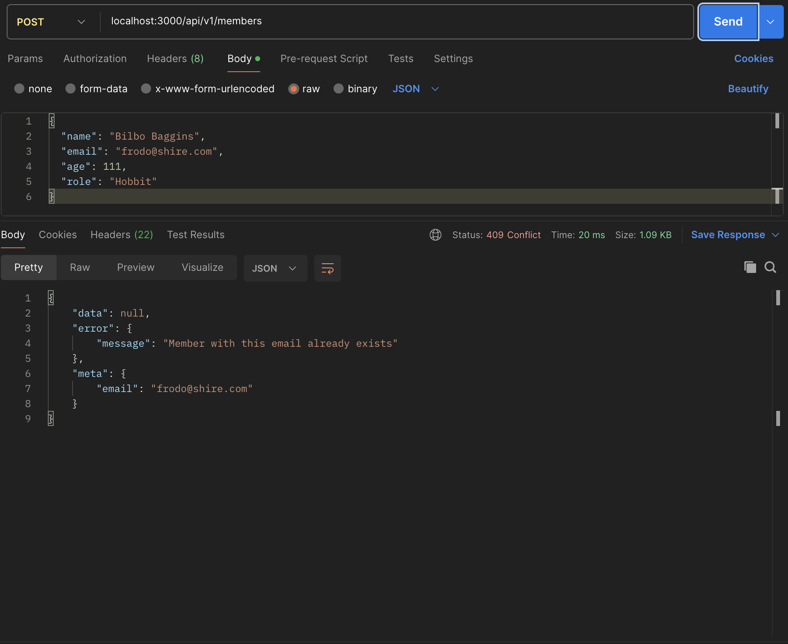

**Delete Member (DELETE)**
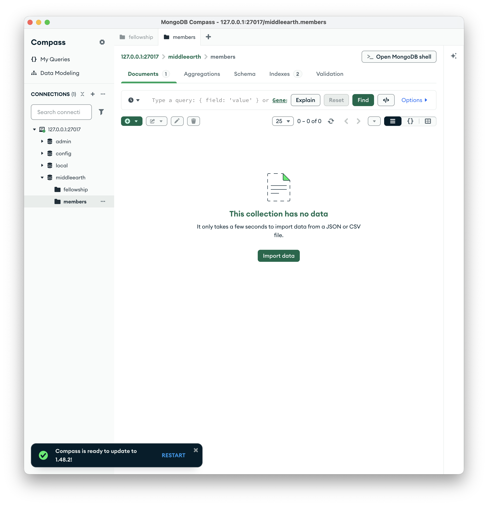

### 3. Frontend Integration

**Registration Flow**
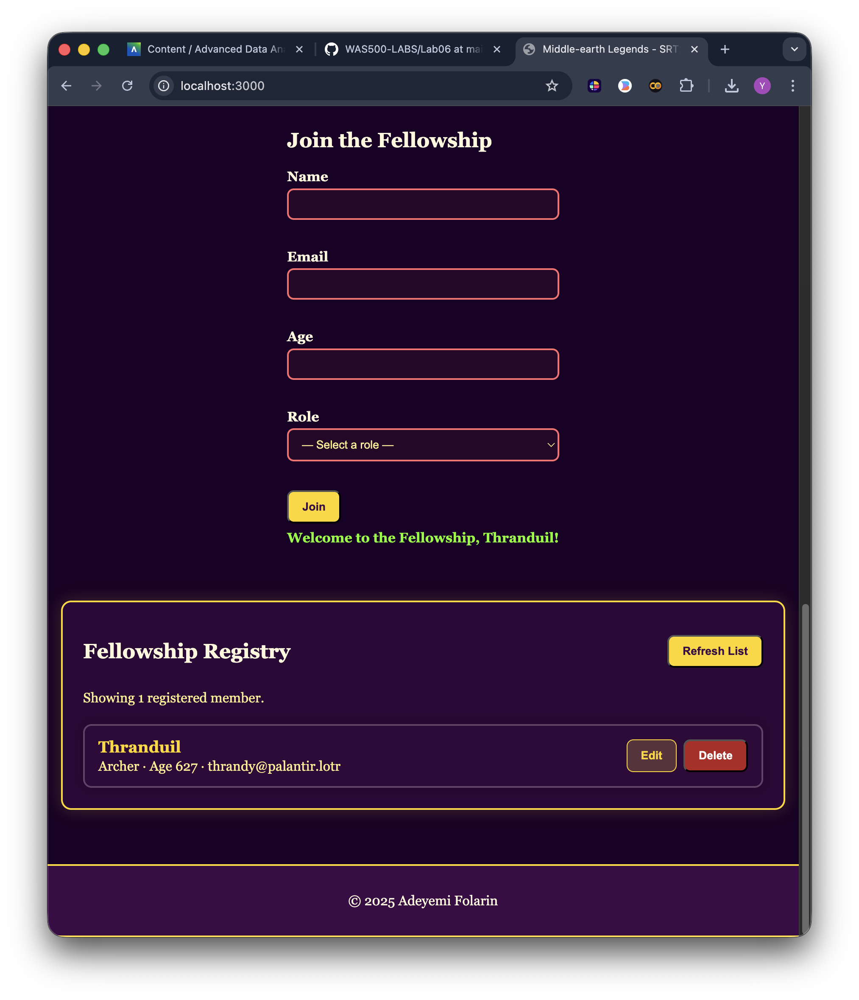

**Update Flow**
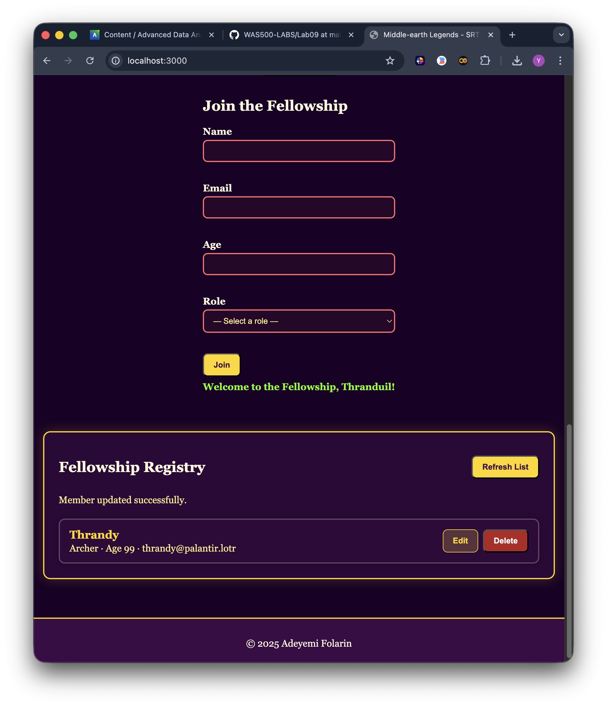

## Reflection

1. **Full-stack integration vs. Lab07/08**  
   I finally replaced the JSON file loop from Lab07 with an actual Mongoose layer, which meant I could stop worrying about manual file locking and timestamp bookkeeping. Because Lab08 already familiarized me with Compass and mongosh, I was comfortable watching documents update live while I hit the Express endpoints. Debugging changed as well: instead of `console.log` in file IO, I relied on Mongo connection logs, Mongoose validation errors, and network traces from both Postman and the browser’s DevTools to make sure the API/DOM stayed in sync.

2. **Validation & safety**  
   I now have DTO rules enforced by `express-validator` before the request ever touches Mongo, and Mongoose schema validation (unique email, enum roles, min/max lengths) as a second line of defense. It felt good to see duplicate emails surface as clean 409 responses. The next security improvements would be tightening CORS to a known origin for production.

3. **Next steps**  
   If I had more time I would start planning authentication (even a simple API key) so random users can’t spam the registry.

