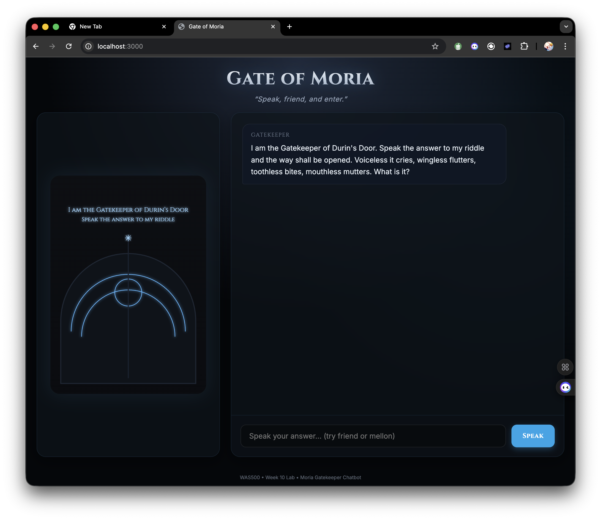
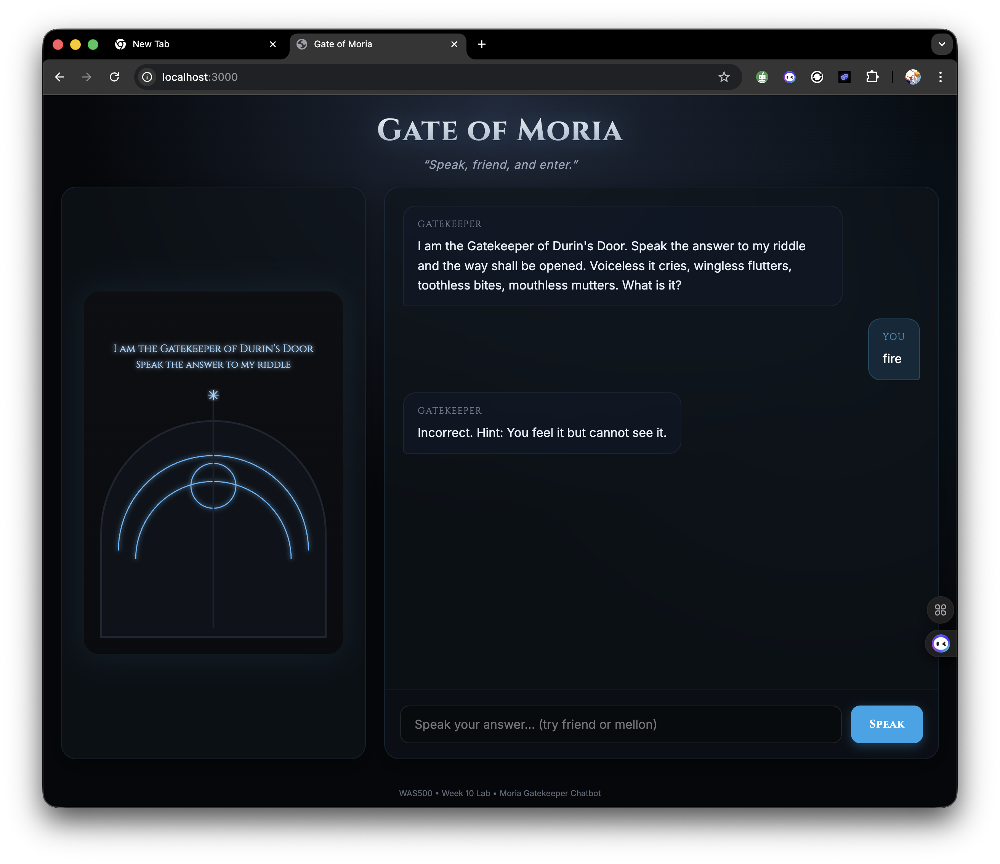
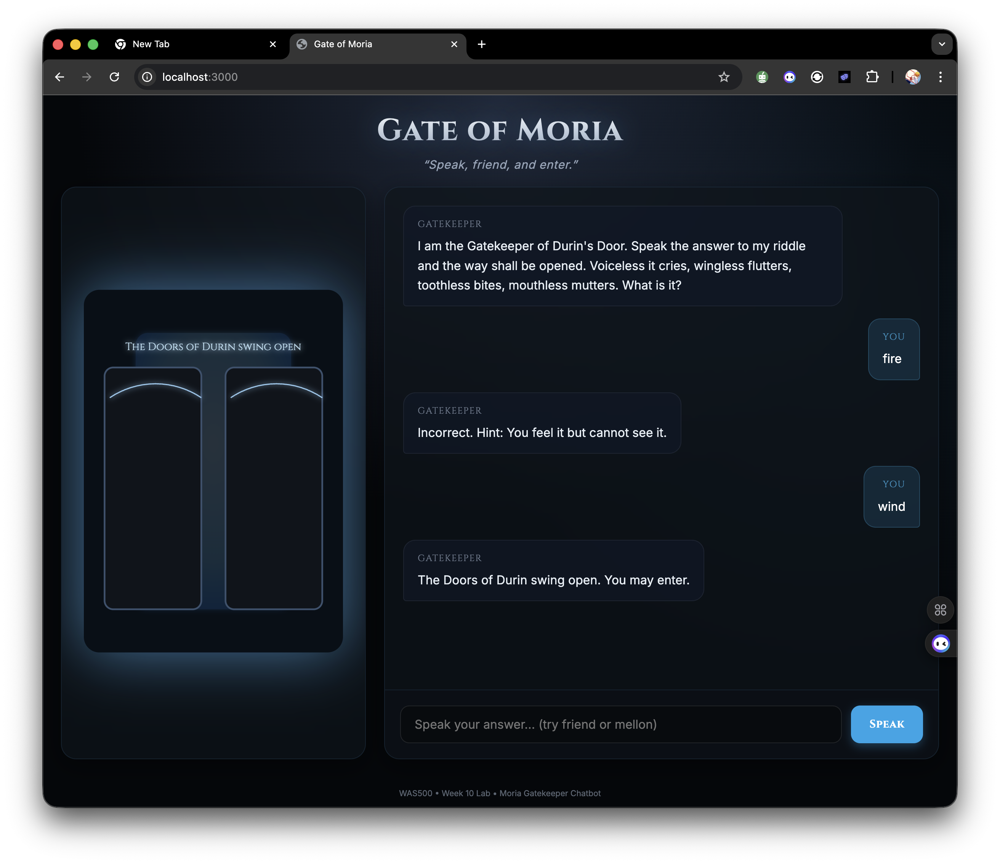

# Lab 10 Report - AI-Powered Chatbot Integration

- Name: Adeyemi Folarin
- Student ID: 123224214
- Date: November 24, 2025

## Screenshots

### Initial Greeting + Riddle

### Wrong Answer

### Correct Answer

### Door Opening

## Reflection

**What felt different from CRUD labs?**
This lab felt significantly more dynamic than previous CRUD labs. In CRUD, the data is structured and predictable—I know exactly what columns I'm reading or writing. With the AI integration, the "data" is natural language, which is inherently fuzzy. I had to think more about the *flow* of conversation and maintaining context (history) rather than just managing database records. The interaction felt more "alive" because the backend wasn't just retrieving data; it was generating new content on the fly.

**What was easier with SDK?**
The OpenAI SDK made connecting to the AI incredibly simple. Instead of manually constructing complex HTTP requests with headers and parsing raw fetch responses, I could just call `client.chat.completions.create()`. It felt like calling a standard local function. The SDK abstracted away all the networking complexity, allowing me to focus entirely on the prompt engineering and logic.

**What was harder?**
The hardest part was managing the unpredictability of the AI's output. Even with a good prompt, there's a chance the AI might return text when I asked for JSON, or hallucinate a format I didn't expect. I had to implement more robust error handling and fallbacks (like the mock generator) than I usually would for a database query. Also, debugging "why did the AI say that?" is much harder than debugging "why did this SQL query fail?", because the logic is opaque.
